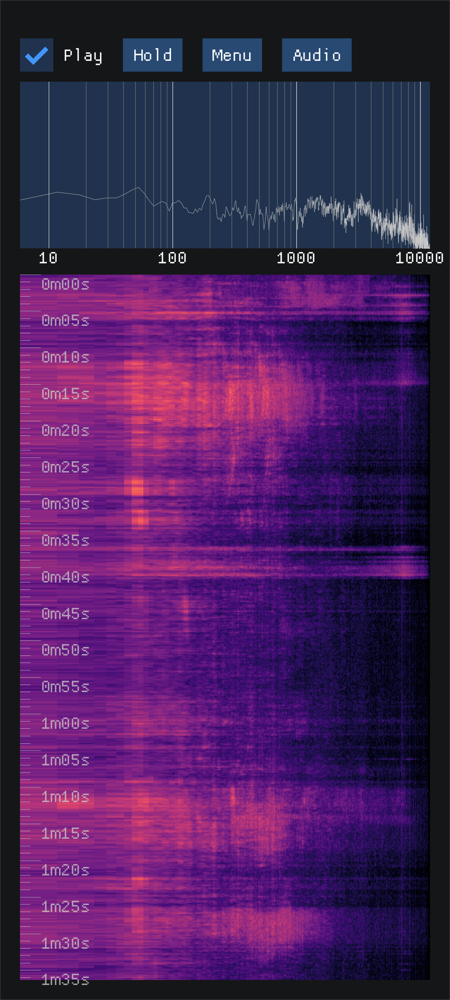

# Spectrogrammer

Android app that computes a spectrogram

## Features
- 4096 bins (freq resolution of )
- Linear / Log scales for both axis
- Hold function
- Waterfall
- Configurable 
    - fft decay
    - fft overlap


## Screenshot


## Building
```
git clone git@github.com:aguaviva/spectrogrammer.git --recurse-submodules --shallow-submodules
./cross-compile-kissfft.sh
./build.sh
```

## Notes/stuff I need help with:
- remember to grant microphone permissions or app will crash
- If app loses focus will crash/lose data

## credits
- cnlohr for [rawdrawandroid](https://github.com/cnlohr/rawdrawandroid)
- mborgerding for [kissfft](https://github.com/mborgerding/kissfft)

[def]: Screenshot.png
