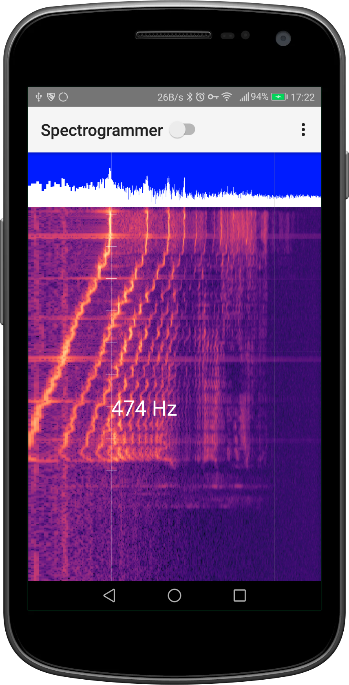
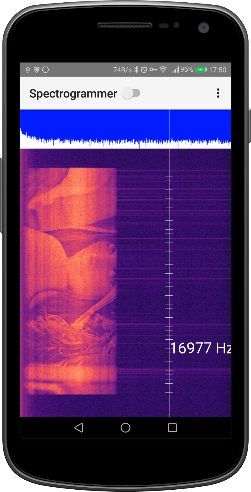

# Spectrogrammer
Android app that shows a spectrogram

## Features
 - Low latency audio (uses openSL and native code)
 - Up to 8192 samples FFT (using FFTW)
 - Log/Linear scales
 - Configurable FFT overlap
 - Vertical bars smoothing 
 - Measuring cursor 

## Screenshots

This is me singing from the lowest note I can perform to the highest. I did this just for the screenshot, and it turns out I have the range of a baritono!

And the final Q/A test, displaying Lena(https://www.youtube.com/watch?v=S64FROErFYA), or half of it as YouTube downsampled the sound to 22Khz.

